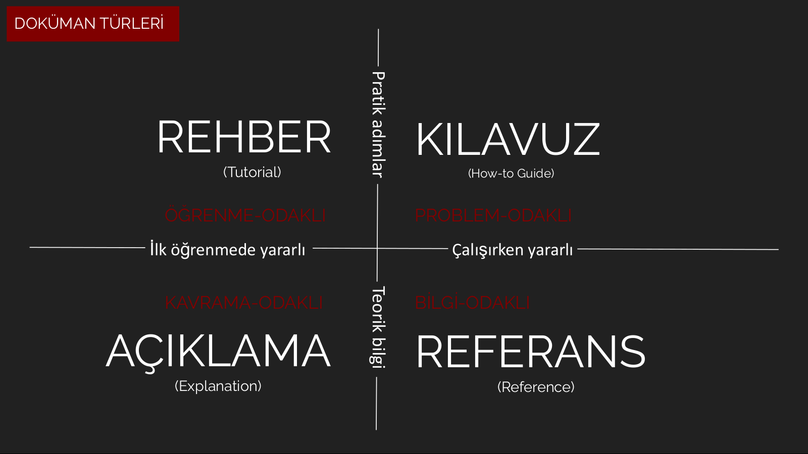

* content
{:toc}

# Giriş

Kapsamlı dokümantasyona sahip bir kütüphanenin, modülün veya *framework*'un kullanıcı tarafından benimsenmesi daha olasıdır. Ürettiği değer göz önünde bulundurulursa, yazılım geliştirmenin bu önemli ayağı standartlaştırılmalıdır. [Divio dokümantasyon sistemi](https://documentation.divio.com/) yazılım sektöründe kullanılmak üzere hazırlanan teknik metinleri tasnif etmek için önerilmiştir. Bu sistem dört temel metin çeşidinden oluşur: rehber, kılavuz, referans ve açıklama. Her dokümanın ne ve nasıl sorularına cevap vermek için yazıldığı varsayımına dayanarak incelenirse, aşağıdaki diyagram kullanılarak doküman çeşidi belirlenebilir. 

<figure>

<figcaption>Fig 1. Doküman çeşitleri özetleyen şema.</figcaption>
</figure>

Yatay eksen dokümanın kullanılacağı bağlamı ayırt ederken, dikey eksen dokümanın doğasını ayırt eden bağlamı belirtir. Burada doğa kelimesi metinin içerik ve üslup yapısını ifade eder. Rehber ve kılavuz metinleri için yalın ve uygulama odaklı bir yaklaşım kullanılır. Açıklama ve referans metinleri için kuru ve teorik bilgi odaklı bir yaklaşım kullanılır.   

Bir e-ticaret *framework*'u göz önüne alınırsa metin örnekleri şöyledir. Rehber örneği projenin kurulumu ve minimum web sitesi oluşturmayı anlatır. Kılavuz örneği siteye nasıl *login* sistemi ekleneceğini gösterir ve hedef odaklıdır. Açıklama örneği belirli bir fonksiyonun kullanımı ve nasıl çalıştığının açıklanmasıdır. Referans örneği tüm API'ların listelenmesi ve arayüzlerin açıklanmasıdır. Her metin çeşidinin kısa açıklaması ve örneği aşağıdaki tabloda bulunabilir.

| | **Rehber**   (Tutorial) | **Kılavuz**   (How-to Guide) | **Referans**   (Reference) | **Açıklama**  (Explanation) |
| :--- | ---: | ---: | ---: | ---: |
| **odağı** | öğrenmedir. | belirli bir görevdir. | bilgi edinmedir. | kavramadır. |
| **olma şartı** | acemi dostu anlatıma sahip olmasıdır. | spesifik bir sorunu çözmesidir. | çalışma mekanizmasını anlatmasıdır. | ayrıntılı açıklama içermesidir.|
| **biçimi** | derstir. | adım adım tariftir. | kuru anlatımdır. | açıklamalı anlatımdır. |
| **örneği**  | çocuğa yemek yapmayı öğretmedir. | yemek tarifidir. | ansiklopedi maddesidir. | Türk mutfağı üzerine makaledir. |

Tüm bunlara ek olarak metin içerisindeki kod açıklamaları için sandviç yöntemi kullanılır. Önce kodun yerine getirdiği işlem veya işlev belirtilir, daha sonra kod verilir ve en sonunda kod açıklanır. Divio sistemini benimseyen projelerin ve firmaların listesi [burada](https://documentation.divio.com/adoption/) bulunabilir.

# Rehber

Rehber kullanıcının bir projeyle veya yazılımla ilk karşılaşmasıdır. Bu yüzden olabildiğince kullanıcı dostu yazılmalıdır. Temel özellikleri şu şekilde sıralanabilir:

- Uygulayarak öğrenme
- Yalın anlatım
- Adım adım ilerleme
- Tekrar edilebilir olma
- Konu dışı ayrıntılardan sakınma
- Soyut anlatım yerine somut adımlar tercih edilmeli
- Sadece gerekli açıklamalar verilmeli

# Kılavuz

Kılavuz yazılıma aşina kullanıcının bir işi yerine getirmek için başvurduğu kaynaktır. Kullanıcı kendi projesine bir işlev veya özellik eklemek için bu metin türüne başvurur. Temel özellikleri şu şekilde sıralanabilir:

- Bir dizi adımlardan oluşur
- Sonuç odaklıdır
- Belirli bir problemi çözer
- Kavramları açıklamaktan kaçınır
- Adımlar esnektir ve küçük farklılıklar kullanıcı isteklerine göre değişebilir
- Eksiksiz olmaktan çok pratiktir

# Açıklama

Açıklama yazılım dokümantasyonun kapsamını genişletir ve kavrama odaklıdır. Herhangi bir işlemi yerine getirme veya öğretme aksine metinin konusu ayrıntılı bir şekilde tartışılır, farklı bakış açıları sunulur. Temel özellikleri şu şekilde sıralanabilir:

- Bağlamı açıkça belirtir
- Alternatifler ve görüşler sunar
- Teknik referans ve talimat sağlamaz

# Referans

Referans çalışma mekanizmasının teknik tasviridir ve bilgi odaklıdır. Temel kavramları açıklamaya çalışmaz. Ansiklopedi girdileri referans metinleri için uygun bir örnektir. Temel özellikleri şu şekilde sıralanabilir:

- Kod tabanı ile aynı yapıya sahiptir
- Tutarlıdır
- Sadece en açık şekilde tasvir yapar
- Doğru ve güncel bilgi içerir
